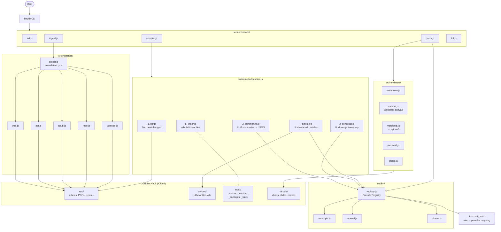

# Architecture

`kb` (distillery) is a Node.js CLI tool that ingests raw sources, compiles them into an LLM-generated knowledge base, and serves queries against it. Output is written to an Obsidian vault synced via iCloud.

## Data Flow



## Vault Layout

The Obsidian vault lives outside this repo at `~/Library/Mobile Documents/iCloud~md~obsidian/Documents/distillery-vault/` and syncs to iOS automatically. All paths are resolved through `src/paths.js` — never constructed manually.

```
vault/<topic>/
  raw/
    articles/      ← ingested web pages
    papers/        ← PDFs
    repos/         ← cloned repositories
    images/
    transcripts/   ← YouTube
    datasets/
  articles/        ← LLM-written wiki with [[backlinks]] and YAML frontmatter
  index/
    _master.md     ← full knowledge base index
    _sources.md    ← source manifest (drives diff detection)
    _concepts.md   ← concept taxonomy
    _stats.md      ← compile statistics
  visuals/
    charts/        ← matplotlib output
    slides/
    canvas/        ← Obsidian .canvas files
  kb.meta.json     ← { topic, created, lastCompiled, compileState, failedSources }
```

## Key Subsystems

### Commands (`src/commands/`)

Each file exports a `make*Command()` factory returning a Commander `Command` instance. `src/cli.js` imports all factories and registers them. Commands needing LLM access follow: load config → create `ProviderRegistry` → call `registry.getForRole('compile'|'query'|'summarize'|'lint')`.

### Ingestor Registry (`src/ingestors/`)

`detect.js` infers source type from URL patterns or file extensions. `src/commands/ingest.js` maps type strings to ingestor functions. Each ingestor takes `(source, rawDir)` and writes a file with YAML frontmatter, returning `{ path, type, title }`.

### Compilation Pipeline (`src/compiler/pipeline.js`)

Five sequential steps — each writes to disk before the next begins:

| Step | File | Responsibility |
|------|------|----------------|
| 1 | `diff.js` | Compare `raw/` against `index/_sources.md` to find new/changed files |
| 2 | `summarize.js` | LLM summarizes each source → `{ summary, concepts, tags }` JSON |
| 3 | `concepts.js` | LLM merges new concepts into the existing taxonomy |
| 4 | `articles.js` | LLM writes wiki articles per concept with `[[backlinks]]` |
| 5 | `linker.js` | Rebuilds all four index files |

### LLM Provider Abstraction (`src/llm/`)

`provider.js` defines the base `LLMProvider` class. Three providers extend it: `anthropic.js`, `openai.js`, `ollama.js`. `ProviderRegistry` maps provider names to classes and supports role-based selection. `kb.config.json` maps roles to provider names so different tasks can use different models. Providers use dynamic imports so SDKs are only loaded when used.

### Renderers (`src/renderers/`)

Five output formats. Each takes `(content, question, topicPath)` and writes to the appropriate subdirectory:

| Renderer | Output |
|----------|--------|
| `markdown.js` | `.md` files |
| `canvas.js` | Obsidian `.canvas` JSON |
| `matplotlib.js` | Charts via `python3` subprocess |
| `mermaid.js` | Delegates to `markdown.js` |
| `slides.js` | Slide decks |

## Configuration

`kb.config.json` at project root maps roles to providers:

```json
{
  "providers": {
    "anthropic": { "apiKeyEnv": "ANTHROPIC_API_KEY", ... },
    "openai":    { "apiKeyEnv": "OPENAI_API_KEY", ... }
  },
  "roles": {
    "compile":   "anthropic",
    "query":     "anthropic",
    "summarize": "anthropic",
    "lint":      "openai"
  }
}
```

API keys are always read from environment variables — never stored in the config file.

## Module System

ES modules throughout (`"type": "module"` in `package.json`). Node v20+ required. `pdf-parse` is a CJS package imported via `createRequire` in `src/ingestors/pdf.js`.

## Testing

Node's built-in test runner (`node:test`). All tests use `tmpdir()` for isolation — no test touches the real vault. LLM-calling code is not unit tested. Test files mirror source structure under `tests/`.

```bash
node --test tests/**/*.test.js        # all tests
node --test tests/compiler/diff.test.js  # single file
```
